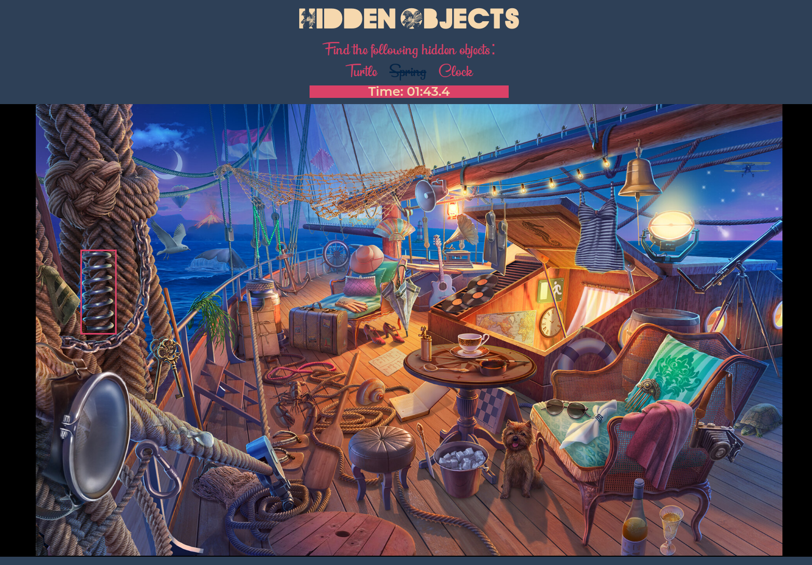

# Photo Tag
Game of find the hidden objects with photo tagging

[Live Preview](https://bchung54.github.io/photo-tag)

# Journey Through the TOP: My Web Dev Journey [(The Odin Project)](https://theodinproject.com/)

[Project #1: Recipes](https://github.com/bchung54/odin-recipes) [HTML]

[Project #2: Landing Page](https://github.com/bchung54/landing-page) [HTML | CSS + flexbox]

[Project #3: Rock Paper Scissors](https://github.com/bchung54/rockpaperscissors) [HTML | CSS | JavaScript]

[Project #4: Etch-a-Sketch](https://github.com/bchung54/etch-a-sketch) [HTML | CSS | JavaScript + events]

[Project #5: Calculator](https://github.com/bchung54/calc-project) [HTML | CSS | JavaScript]

[Project #6: Sign-up Form](https://github.com/bchung54/sign-up-form) [HTML | CSS | JavaScript]

[Project #7: Admin Dashboard](https://github.com/bchung54/admin-dashboard) [HTML | CSS | JavaScript]

[Project #8: Library](https://github.com/bchung54/library-project) [HTML | CSS | JavaScript + Objects]

[Project #9: Tic Tac Toe](https://github.com/bchung54/tic-tac-toe) [HTML | CSS | JavaScript + Factory Functions + The Module Pattern]

[Project #10: Restaurant Page](https://github.com/bchung54/restaurant-page) [HTML | CSS | JavaScript + ES6 Modules + Webpack]

[Project #11: ToDo-dile](https://github.com/bchung54/todo-list) [HTML | CSS | JavaScript + ES6 Modules + Webpack]

[Project #12: Weather App](https://github.com/weather-app) [HTML | CSS | JavaScript + Webpack + async API]

[Project #13: Battleship](https://github.com/battleship) [HTML | CSS | JavaScript + Webpack + TDD with Jest]

[Project #14: CV Application](https://github.com/cv-project) [HTML | CSS | JavaScript + React]

[Project #15: Memory Card Game](https://github.com/memory-cards) [HTML | CSS | JavaScript + React]

[Project #16: Shopping Cart](https://github.com/shopping-cart) [HTML | CSS | JavaScript + React]

[Project #17: Photo Tag](https://github.com/photo-tag) [HTML | CSS | JavaScript + Webpack + Firebase]
